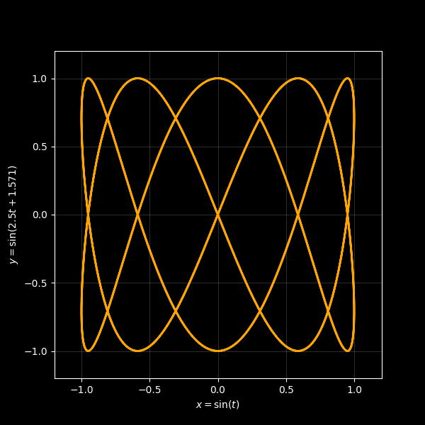
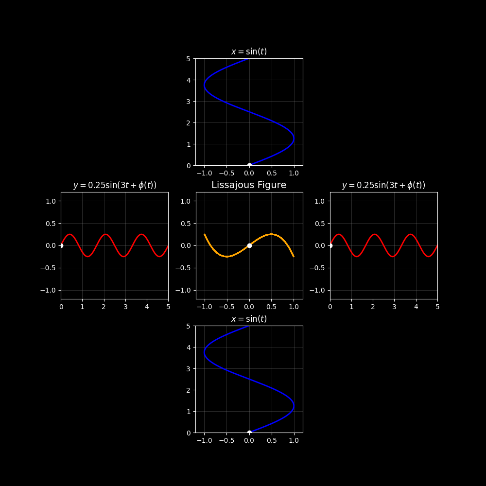

## Contents

* [Required Packages](#required-packages)
* [Auxiliary Functions](#auxiliary-functions)
* [PNG Lissajous](#png-lissajous)
* [GIF Lissajous Without Waves](#gif-lissajous-without-waves)
* [GIF Lissajous With Waves](#gif-lissajous-with-waves)

<br>

---

## Required Packages
* `numpy`: for vast majority of mathematical functions used.
* `Fraction`: used once in the `joint_period` auxiliary function.
* `matplotlib`: for plotting the Lissajous figures and creating the PNGs and GIFs.

<br>

---

## Auxiliary Functions

```python
def joint_period(af1, af2):
```
Given two angular frequencies, `af1` and `af2`, this function calculates the $x$ distance of the "overlapping period" of two sine waves with those angular frequencies &mdash; used to calculate the minimum interval for which to sample over to produce the Lissajous figures.

* `af` (float): angular frequency of th $x$ wave.
* `af2` (float): angular frequency of the $y$ wave.

<br>

```python
def format_coeff(num):
```
A function for cleaning the coefficients of the plot axes' titles, for example, turning $1\sin 1x$ into $\sin x$.

* `num` (float): the coefficient in question, any on of: $A_x$, $\omega_x$, $A_y$, $\omega_y$.

<br>

```python
def format_phase(phi):
```
A function for cleaning the phase parameter.

* `phi` (float or str): the phase for the $y$ wave. If `phi='phi(t)'` is passed, the function will return `' + \phi(t)'` but only if `vary_phase=True`.

<br>

```python
def one_plot(amp1, af1, amp2, af2, phi):
```

Creates the single matplotlib plot used in the `still_liss` and `anim_liss` functions.

* `amp1` (float): amplitude of the $x$ wave.
* `af1` (float): angular frequency of the $x$ wave.
* `amp2` (float): amplitude of the $y$ wave.
* `af2` (float): angular frequency of the $y$ wave.
* `phi` (float): phase of the $y$ wave.

<br>

---

## PNG Lissajous

```python
def still_liss(amp1=1, af1=1, amp2=1, af2=1, phi=0):
```
The function that plots a still image of a Lissojous figure on a single plot.

* `amp1` (float): amplitude of the $x$ wave. Automatically set to 1.
* `af1` (float): angular frequency of the $x$ wave. Automatically set to 1.
* `amp2` (float): amplitude of the $y$ wave. Automatically set to 1.
* `af2` (float): angular frequency of the $y$ wave. Automatically set to 1.
* `phi` (float): phase of the $y$ wave. Automatically set to 0.

Below is an example call and output to the function: 

`still_liss(af2=2.5, phi=np.pi/2)`

<p align="center">
  
</p>

<br>

---

## GIF Lissajous Without Waves

```python
def anim_liss(amp1=1, af1=1, amp2=1, af2=1, phi=0, draw=False, vary_phase=True, show_dot=False, frames=200, fps=20):
```

The function that plots a moving Lissajous figure, with any or none of: a varying phase, a white dot to trace the path, and a parameter to draw and erase the figure.

* `amp1` (float): amplitude of the $x$ wave. Automatically set to 1.
* `af1` (float): angular frequency of the $x$ wave. Automatically set to 1.
* `amp2` (float): amplitude of the $y$ wave. Automatically set to 1.
* `af2` (float): angular frequency of the $y$ wave. Automatically set to 1.
* `phi` (float): phase of the $y$ wave. Automatically set to 0.
* `draw` (bool): whether or not to *draw and erase* the Lissajoud figure, defaulted to False.
* `vary_phase` (bool): varies the phase $\phi$ of the $y$ wave from $0$ to $2 \pi$ &mdash; this causes the Lissajous figure to "rotate". Defaulted to True.
* `show_dot` (bool): shows a white dot that traces the path of the Lissajous figure with time starting from $0$ and ending at the end of the cycle (`frames/fps`). Automically set to False.
* `frames` (int): the number of frames to show in the GIF, set to 200 by default.
* `fps` (int): the frames per second of the GIF, defualted to 20. Note: due to limitations of Matplotlib, the fps of the GIF has to be relativiely low (20 is recommended), else it will not produce a valid GIF file.

Note: setting all the above Boolean parameters to False produces a GIF with no movement &mdash; using `still_liss` would be more efficient if that effect is desired.

Example call and output: 

`anim_liss(amp1=0.5, af1=0.9, draw=True, show_dot=False, vary_phase=True, frames=200, fps=20)`

<p align="center">
  
</p>

<br>

---

## GIF Lissajous With Waves

```python
def liss_and_waves(amp1=1, af1=1, amp2=1, af2=1, phi=0, draw=False, vary_phase=True, show_dot=False, frames=200, fps=20):
```

Plots the standard Lissajous figure, with the same parameters as `anim_liss`, but instead surrounded by the the $x$ and $y$ waves to provide a nice visual and intuition of the formation of Lissajous figures.

* `amp1` (float): amplitude of the $x$ wave. Automatically set to 1.
* `af1` (float): angular frequency of the $x$ wave. Automatically set to 1.
* `amp2` (float): amplitude of the $y$ wave. Automatically set to 1.
* `af2` (float): angular frequency of the $y$ wave. Automatically set to 1.
* `phi` (float): phase of the $y$ wave. Automatically set to 0.
* `draw` (bool): whether or not to *draw and erase* the Lissajoud figure, defaulted to False.
* `vary_phase` (bool): varies the phase $\phi$ of the $y$ wave from $0$ to $2 \pi$ &mdash; this causes the Lissajous figure to "rotate". Defaulted to True.
* `show_dot` (bool): shows a white dot that traces the path of the Lissajous figure with time starting from $0$ and ending at the end of the cycle (`frames/fps`). Automically set to False.
* `frames` (int): the number of frames to show in the GIF, set to 200 by default.
* `fps` (int): the frames per second of the GIF, defualted to 20. Note: due to limitations of Matplotlib, the fps of the GIF has to be relativiely low (20 is recommended), else it will not produce a valid GIF file.

Example call and output:

`liss_and_waves(amp2=0.25, af2=3, draw=False, vary_phase=True, show_dot=True, frames=200, fps=20)`

<p align="center">
  
</p>
