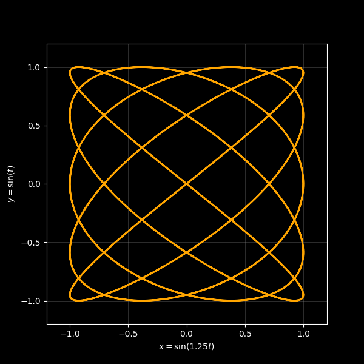
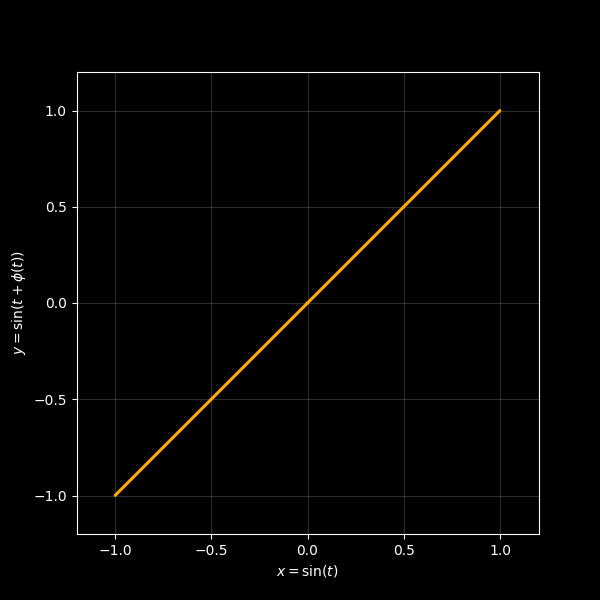
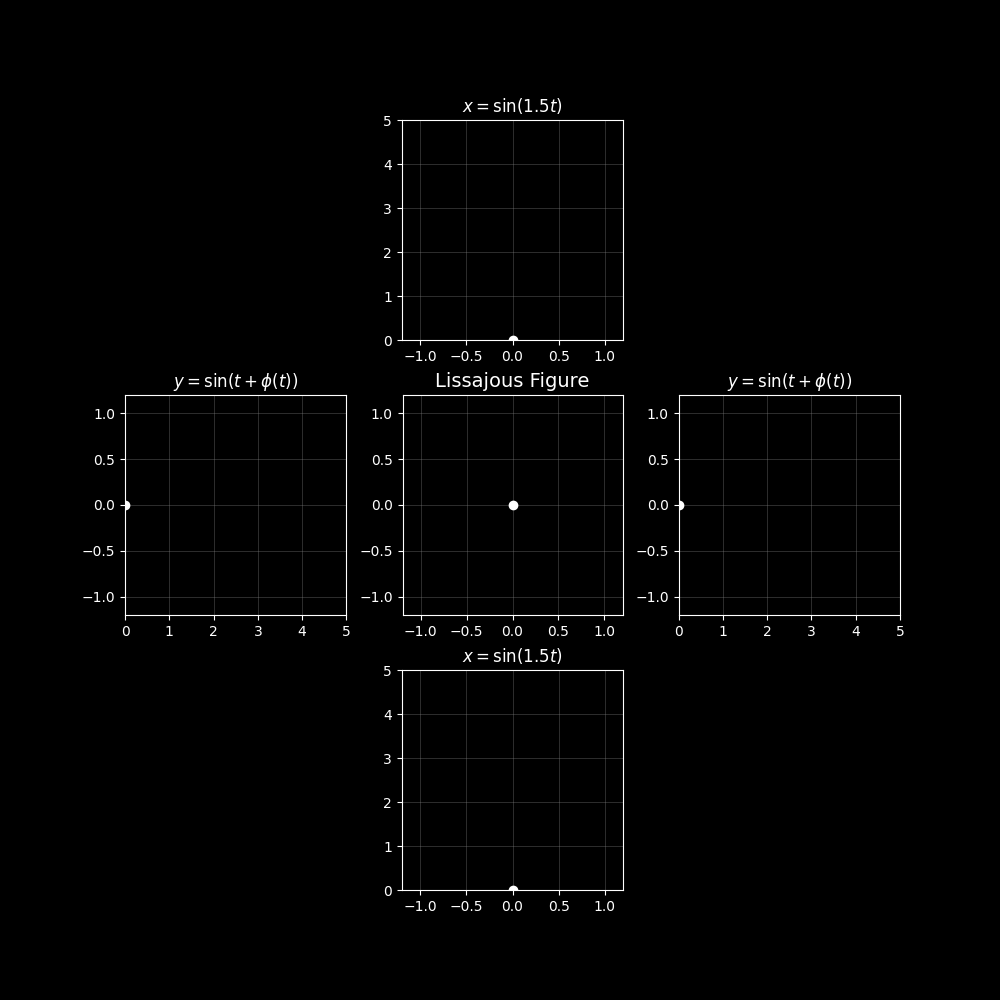

<table align="center">
  <tr>
    <td></td>
    <td></td>
    <td></td>
  </tr>
</table>

# Python Lissajous Figure Maker
Python code for plotting Lissajous figures as either PNGs or GIFs through Matplotlib.

The code constructs Lissajous figures from the parametric equations $x = A_x \sin (\omega_x t)$ and $y = A_y \sin (\omega_y t + \phi)$. Where the values $A_x$, $\omega_x$, $A_y$, $\omega_y$ and $\phi$ are all specified by the user. For the animated figures, setting `vary_phase=True` ignored any phase input, and automatically cycles $\phi$ through $0$ to $2 \pi$.

This code isn't designed to be efficient, and depending on the system this code is run on, it could take upwards of 2 minutes for high-resolution GIFs to be created.

